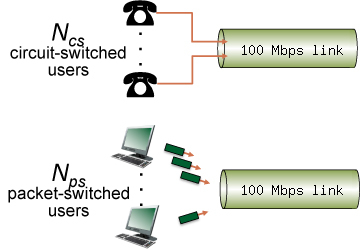

# Quantitative Comparison of Packet Switching and Circuit Switching

This question requires a little bit of background in probability (but we'll try to help you though it in the solutions). Consider the two scenarios below:

A circuit-switching scenario in which Ncs users, each requiring a bandwidth of 20 Mbps, must share a link of capacity 100 Mbps.

A packet-switching scenario with Nps users sharing a 100 Mbps link, where each user again requires 20 Mbps when transmitting, but only needs to transmit 20 percent of the time.

Answer the following questions:

1. When circuit switching is used, what is the maximum number of circuit-switched users that can be supported? Explain your answer.

> 5 users that can be supported. For circuit-switching, each user's bandwidth is fixed(20 Mbps), so maximum support is 100/20 = 5;

2. For the remainder of this problem, suppose packet switching is used. Suppose there are 9 packet-switching users (i.e., Nps = 9). Can this many users be supported under circuit-switching? Explain.

> No, because one circuit-switching user must be allocated for 20 Mbps, and there is only capacity 100Mbps available, so it only can support maxmimum 5 users under circuit-switching;

3. What is the probability that a given (specific) user is transmitting, and the remaining users are not transmitting?

> a specific user only need 20 percent of the time to transmit, so 1/5; denoted p = 1/5, and the remaining users are not transmitting, which is (1 - p)^(N - 1), so the final answer is p * (1- p)^(N - 1);

4. What is the probability that one user (any one among the 9 users) is transmitting, and the remaining users are not transmitting? When one user is transmitting, what fraction of the link capacity will be used by this user?

> one user is transmitting and the other not -> p(1 - p)^(N - 1); any of them, so for one user, he can choose transmit or not transmit, this is a binomial distribution question: X is the random variable, so P(X = 1) = N!/(1 * !(N-1)) = N, so the final answer is P(X = 1) * p(1 - p)^(N - 1);

5. What is the probability that any 5 users (of the total 9 users) are transmitting and the remaining users are not transmitting? (Hint: you will need to use the binomial distribution [1, 2]).

> as the last one but P(X = 5) * p^5 * (1 - p)^(N - 5)

6. What is the probability that more than 5 users are transmitting? Comment on what this implies about the number of users supportable under circuit switching and packet switching.

> P(X = i) * p^i * (1 - p)^(N - i) sum for i from 6 to 9